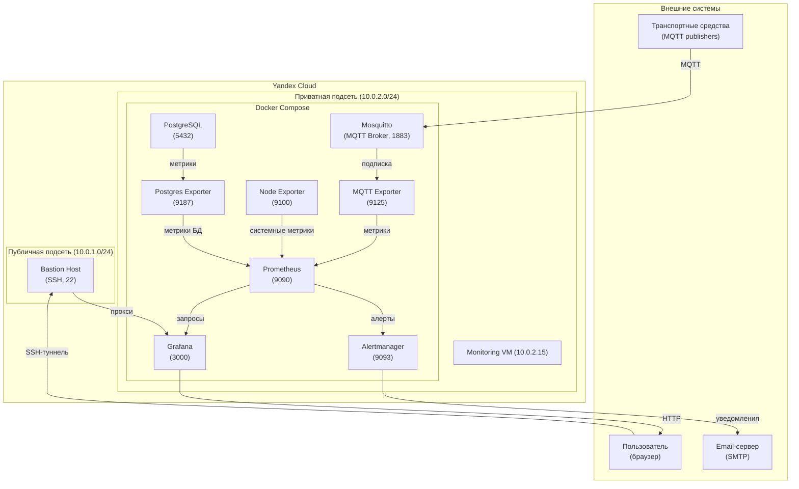
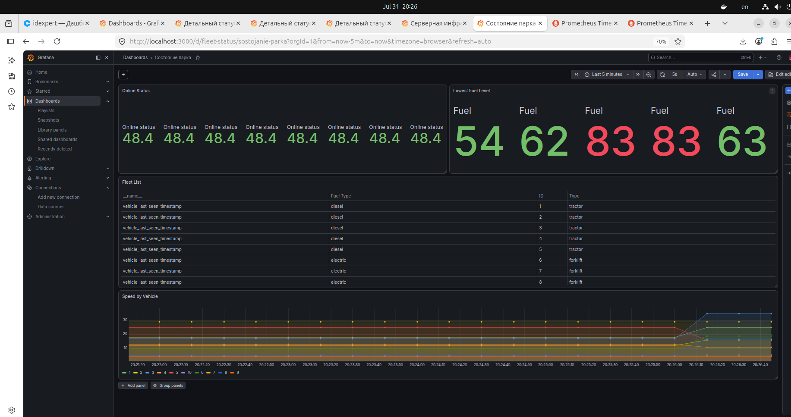
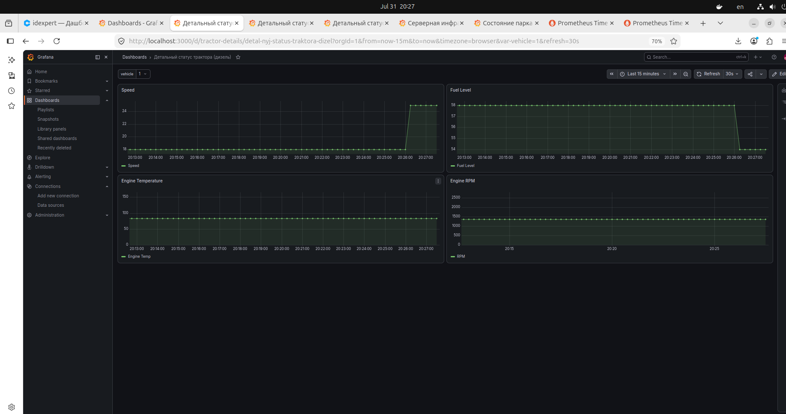
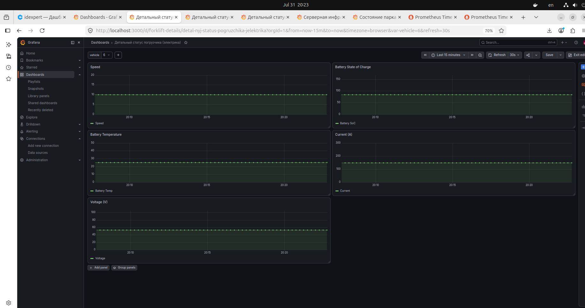
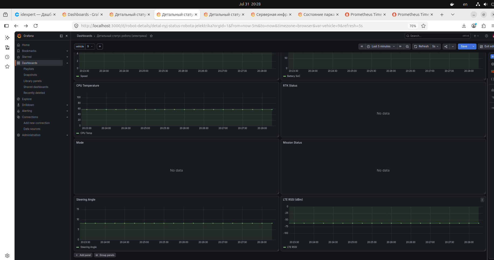
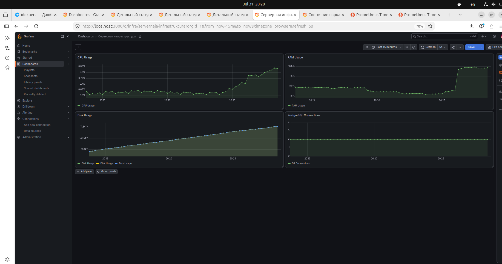
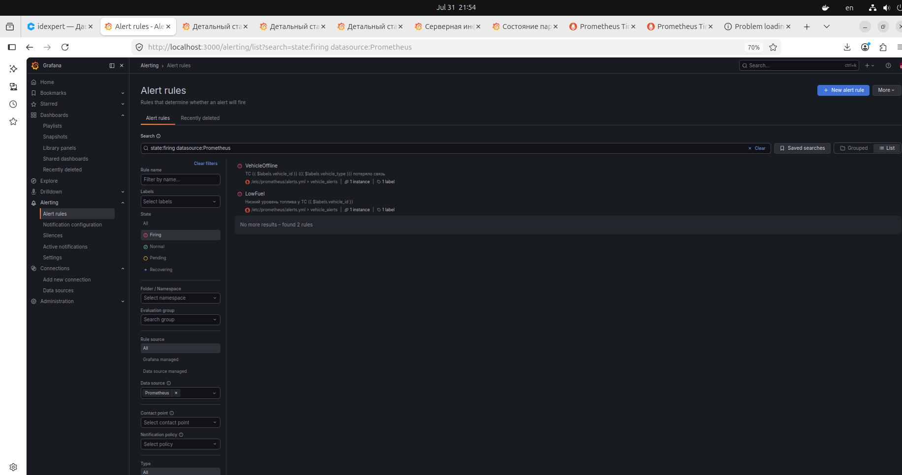

# Мониторинг телеметрии транспортных средств (Prometheus + Grafana) - Старцев Данила Антонович


---

## Цель задания

Настроить рабочий стенд **Prometheus + Grafana** для сбора, хранения и визуализации метрик телеметрии парка транспортных средств в реальном времени.

Система должна обеспечивать:

- приём данных из MQTT-топиков и преобразование в метрики Prometheus;
- визуализацию состояния техники и серверной инфраструктуры в Grafana;
- оповещения о критических событиях (алерты).

---

## Решаемые задачи

1. Развёртывание инфраструктуры мониторинга – Prometheus, Grafana, Alertmanager, Node Exporter, Postgres Exporter в Docker Compose.
2. Настройка MQTT-экспортера – подписка на топики телеметрии, парсинг JSON, генерация метрик, endpoint `/metrics`.
3. Настройка сбора метрик с серверных сервисов – системных (CPU/RAM/диск) и PostgreSQL.
4. Создание дашбордов в Grafana: «Состояние парка», «Детальный статус трактора», «Детальный статус погрузчика», «Детальный статус робота», «Серверная инфраструктура».
5. Настройка алертов – оповещения по email о потере связи, высокой температуре CPU, статусе RTK None и других критических событиях.
6. Документирование – инструкция по развёртыванию, описание метрик и дашбордов.

---

## Архитектура решения



### Пояснение к диаграмме

| Компонент | Роль в системе |
|-----------|----------------|
| **Транспортные средства** | Отправляют телеметрию по MQTT в брокер Mosquitto |
| **Mosquitto** | MQTT-брокер, принимающий данные от ТС |
| **MQTT-экспортер** | Подписывается на топики, парсит JSON и создаёт метрики Prometheus |
| **Prometheus** | Собирает метрики с экспортеров, хранит их, применяет правила алертов |
| **Grafana** | Визуализирует данные через дашборды (доступ через SSH-туннель) |
| **Alertmanager** | Обрабатывает алерты и отправляет уведомления по email |
| **Node Exporter** | Собирает системные метрики мониторинговой ВМ |
| **Postgres Exporter** | Собирает метрики с PostgreSQL |
| **Bastion** | Обеспечивает безопасный доступ к Grafana извне через SSH-туннель |

---

## Компоненты и их настройка

| Компонент | Назначение | Порт | Endpoint |
|-----------|------------|------|----------|
| **Mosquitto** | MQTT-брокер | 1883 | `tcp://<ip>:1883` |
| **MQTT-экспортер** | Подписка на топики, преобразование в метрики | 9125 | `http://<ip>:9125/metrics` |
| **Prometheus** | Сбор, хранение, правила алертов | 9090 | `http://<ip>:9090` |
| **Grafana** | Визуализация, дашборды | 3000 | `http://<ip>:3000` |
| **Alertmanager** | Обработка алертов, отправка email | 9093 | `http://<ip>:9093` |
| **Node Exporter** | Системные метрики ВМ | 9100 | `http://<ip>:9100/metrics` |
| **Postgres Exporter** | Метрики PostgreSQL (тестовая БД) | 9187 | `http://<ip>:9187/metrics` |

---

## Структура метрик (соответствует протоколу телеметрии)

Все метрики имеют лейблы: `vehicle_id`, `vehicle_type`, `fuel_type`.

### Общие метрики
```promql
gps_lat, gps_lon, gps_alt, speed_kmh, engine_status (on/off)
```

### Для дизельной техники (тракторы)
```promql
engine_rpm, fuel_level_pct, temp_c, oil_pressure_bar, engine_hours
```

### Для электрической техники (погрузчики, тележки)
```promql
battery_soc_pct, battery_temp_c, current_a, voltage_v
```

### Для роботов (ВАТС)
```promql
mode, mission_status, mission_id, estop_status, rtk_status, steering_angle_deg, temp_cpu_c, lte_rssi
```

### События
```promql
vehicle_events_total (счётчик событий по типам и severity)
```

### Системные метрики
```promql
CPU, RAM, диск, подключения к БД (через Node Exporter и Postgres Exporter)
```

---

## Дашборды в Grafana

Все дашборды автоматически загружаются через **provisioning** из JSON-файлов (папка `configs/grafana/dashboards/`). Дашборды интерактивны: фильтр по времени и выбор конкретного ТС (через выпадающий список `vehicle`).

| Дашборд | Назначение | Основные панели |
|---------|------------|----------------|
| **Состояние парка** | Общий мониторинг всех ТС | Таблица ТС (онлайн/офлайн, GPS, уровень топлива/заряда), геокарта, график скорости всех ТС |
| **Детальный статус трактора (дизель)** | Анализ конкретного трактора | Speed, Fuel Level, Engine Temperature, Engine RPM |
| **Детальный статус погрузчика (электрика)** | Анализ погрузчика | Speed, Battery SoC, Battery Temperature, Current, Voltage |
| **Детальный статус робота (электрика)** | Анализ робота | Speed, Battery SoC, CPU Temperature, RTK Status, Mode, Mission Status, Steering Angle, LTE RSSI |
| **Серверная инфраструктура** | Мониторинг сервера и БД | CPU Usage, RAM Usage, Disk Usage, PostgreSQL Connections |

### Примеры дашбордов


*Дашборд «Состояние парка» – общий мониторинг всех ТС с таблицей и картой.*


*Детальный статус трактора (дизель) – графики скорости, топлива, температуры и оборотов.*


*Детальный статус погрузчика (электрика) – графики скорости, заряда батареи, температуры, тока и напряжения.*


*Детальный статус робота (электрика) – графики скорости, заряда батареи, CPU, RTK, режима, миссии, угла поворота и LTE.*


*Дашборд «Серверная инфраструктура» – CPU, RAM, диск, подключения к БД.*

---

## Алерты (Alertmanager)

Настроены правила алертов в Prometheus (`configs/prometheus/alerts.yml`):

| Правило | Условие | Severity |
|---------|---------|----------|
| `VehicleOffline` | Потеря связи > 5 минут | `critical` |
| `HighCPUTemp` | Температура CPU > 75°C | `warning` |
| `RTKStatusNone` | RTK статус = None более 30 секунд | `critical` |
| `LowFuel` | Уровень топлива < 10% | `warning` |
| `LowBattery` | Заряд батареи < 20% | `warning` |

Алерты отправляются на **email** через SMTP-сервис (используется [SMTP.BZ](https://smtp.bz) для тестирования).


---

## Инструкция по развёртыванию в Yandex Cloud

### Требования

| Требование | Версия / Описание |
|------------|-------------------|
| **Terraform** | >= 1.5.x |
| **Ansible** | >= 2.9 |
| **Yandex Cloud CLI** | последняя версия |
| **SSH-ключ** | для доступа к ВМ (ed25519) |
| **Аккаунт Yandex Cloud** | с ролями `editor` и `auditor` |

---

### 1. Клонирование репозитория

```bash
git clone https://github.com/ваш-username/ID_Expert.git
cd ID_Expert
```

---

### 2. Настройка секретов

Перед развёртыванием скопируйте шаблоны и заполните их своими данными:

- `terraform/terraform.tfvars.example` → `terraform/terraform.tfvars`
- `.secrets.example` → `~/.secrets/monitoring.env` (или `.env` для локального запуска)
- `.env.example` → `.env` (для локального запуска)

Подробные инструкции по заполнению смотрите в комментариях внутри файлов.

Создайте файл `~/.secrets/monitoring.env` и заполните:

```bash
export YC_TOKEN="$(yc iam create-token)"
export YC_CLOUD_ID="ваш_cloud_id"
export YC_FOLDER_ID="ваш_folder_id"
export TF_VAR_ssh_public_key="$(cat ~/.ssh/id_ed25519_monitoring.pub)"
export PRIVATE_KEY_PATH="$HOME/.ssh/id_ed25519_monitoring"
export GRAFANA_PASSWORD="qwe1234"              # задайте свой
export SMTP_HOST="smtp.bz"                     # или ваш SMTP-сервер
export SMTP_PORT="587"
export SMTP_USER="ваш_логин"
export SMTP_PASSWORD="ваш_пароль"
export SMTP_FROM="отправитель@example.com"
export SMTP_TO="получатель@example.com"
```

Подгрузите переменные:

```bash
source ~/.secrets/monitoring.env
```

---

### 3. Развёртывание инфраструктуры (Terraform)

```bash
cd terraform
terraform init
terraform apply -auto-approve
```

После выполнения запишите IP-адреса:

```bash
export BASTION_IP=$(terraform output -raw bastion_public_ip)
export MONITORING_IP=$(terraform output -raw monitoring_private_ip)

# Проверьте, что IP-адреса получены
echo "Bastion IP: $BASTION_IP"
echo "Monitoring IP: $MONITORING_IP"
```

---

### 4. Настройка серверов (Ansible)

Вернитесь в корень проекта и запустите:

```bash
cd ..
ansible-playbook -i ansible/inventory.yml \
  --private-key "$PRIVATE_KEY_PATH" \
  -e "bastion_ip=$BASTION_IP" \
  -e "monitoring_ip=$MONITORING_IP" \
  -e "private_key_path=$PRIVATE_KEY_PATH" \
  ansible/playbooks/monitoring.yml
```

---

### 5. Доступ к Grafana

Настройте SSH-туннель с локальной машины:

```bash
ssh -L 3000:$MONITORING_IP:3000 -N -f -i $PRIVATE_KEY_PATH ubuntu@$BASTION_IP
```

Откройте в браузере: **http://localhost:3000**  
Логин: `admin`  
Пароль: `qwe1234` (или ваш, если меняли)

> **Примечание:** Дашборды загрузятся автоматически из provisioning. Если они не появились, подождите 10–15 секунд или перезапустите Grafana:  
> `ssh -i $PRIVATE_KEY_PATH ubuntu@$BASTION_IP "cd /opt/monitoring && sudo docker compose restart grafana"`  
> И проверьте логи: `sudo docker compose logs grafana | grep -i provision`.

---

### 6. Отправка тестовых данных

Подключитесь к мониторинговой ВМ и выполните (пример для трактора):

```bash
mosquitto_pub -h localhost -p 1883 -t "tractor/diesel/1/telemetry" -m '{"metrics":{"speed_kmh":25,"fuel_level_pct":78}}'
```

Проверьте появление метрик в Prometheus и графиков в дашбордах.

---

## Структура репозитория

```bash
ID_Expert/
├── ansible/                    # Плейбуки Ansible
│   ├── inventory.yml           # Статический инвентарь
│   ├── group_vars/             # Переменные
│   └── playbooks/
│       └── monitoring.yml      # Основной плейбук
├── terraform/                  # IaC для Yandex Cloud
│   ├── main.tf                 # Основная конфигурация
│   ├── variables.tf            # Переменные
│   ├── outputs.tf              # Вывод IP-адресов
│   └── terraform.tfvars.example # Шаблон секретов
├── docker/                     # MQTT-экспортер
│   └── mqtt-exporter/
│       ├── Dockerfile
│       ├── exporter.py         # Код экспортера
│       ├── config.yaml         # Топики для подписки
│       └── requirements.txt    # Зависимости Python
├── configs/                    # Конфиги сервисов
│   ├── prometheus/
│   │   ├── prometheus.yml      # Конфигурация Prometheus
│   │   └── alerts.yml          # Правила алертов
│   ├── grafana/
│   │   ├── datasources/
│   │   │   └── datasource.yaml # Источник данных Prometheus
│   │   └── dashboards/
│   │       ├── dashboard.yaml  # Provisioning дашбордов
│   │       └── *.json          # Готовые дашборды (5 шт.)
│   └── alertmanager/
│       └── alertmanager.yml.j2 # Шаблон конфигурации Alertmanager
├── scripts/                    # Вспомогательные скрипты
├── docker-compose.yml          # Описание сервисов
├── README.md                   # Этот файл
└── .gitignore                  # Исключения для Git
```

---

## Результаты работы

-  Развёрнута инфраструктура в Yandex Cloud (Terraform + Ansible).
-  Данные телеметрии принимаются по MQTT, преобразуются в метрики Prometheus.
-  Настроены дашборды для всех типов ТС и серверной инфраструктуры.
-  Алерты отправляются на email при критических событиях.
-  Проект полностью воспроизводим (provisioning дашбордов, код в Git).

---

## Локальное развёртывание (без облака)

Проект можно запустить локально на любой машине с Docker. Вся логика сбора метрик, MQTT-экспортер и дашборды работают независимо от облачной инфраструктуры.

### Требования

| Требование | Версия / Описание |
|------------|-------------------|
| **Docker** | >= 20.10 |
| **Docker Compose** | >= 2.0 (или `docker compose` плагин) |
| **Git** | для клонирования репозитория |
| **mosquitto-clients** | (опционально) для отправки тестовых сообщений |

---

### 1. Клонирование репозитория

```bash
git clone https://github.com/ваш-username/ID_Expert.git
cd ID_Expert
```

---

### 2. Настройка переменных окружения

Создайте файл `.env` в корне проекта:

```bash
# Grafana
GRAFANA_PASSWORD=admin

# Email (опционально, для алертов)
SMTP_HOST=smtp.bz
SMTP_PORT=587
SMTP_USER=ваш_логин
SMTP_PASSWORD=ваш_пароль
SMTP_FROM=отправитель@example.com
SMTP_TO=получатель@example.com
```

Если вы не планируете использовать email-алерты, строки SMTP можно не заполнять.

---

### 3. Запуск Docker Compose

```bash
# Для старых версий Docker:
docker-compose up -d

# Для новых версий (плагин):
docker compose up -d
```

Проверьте, что все контейнеры запущены:

```bash
docker compose ps   # или docker-compose ps
```

Должны быть `Up` все сервисы: `mosquitto`, `mqtt-exporter`, `prometheus`, `grafana`, `alertmanager`, `node-exporter`, `postgres`, `postgres-exporter`.

---

### 4. Доступ к интерфейсам

- **Grafana:** `http://localhost:3000`  
  Логин: `admin`  
  Пароль: указанный в `GRAFANA_PASSWORD` (по умолчанию `admin`)

- **Prometheus:** `http://localhost:9090`

- **Alertmanager:** `http://localhost:9093`

- **MQTT-экспортер (метрики):** `http://localhost:9125/metrics`

---

### 5. Импорт дашбордов (автоматически)

Дашборды уже лежат в папке `configs/grafana/dashboards/` и автоматически загружаются через provisioning. Если по какой-то причине они не появились, подождите 10–15 секунд или перезапустите Grafana:

```bash
docker compose restart grafana
```

Затем проверьте логи:

```bash
docker compose logs grafana | grep -i provision
```

---

### 6. Отправка тестовых данных

Установите `mosquitto-clients` (если ещё не установлены):

```bash
# Ubuntu / Debian
sudo apt update && sudo apt install -y mosquitto-clients

# macOS
brew install mosquitto

# Windows (через Chocolatey)
choco install mosquitto
```

Отправьте тестовое сообщение для трактора:

```bash
mosquitto_pub -h localhost -p 1883 -t "tractor/diesel/1/telemetry" -m '{"metrics":{"speed_kmh":25,"fuel_level_pct":78}}'
```

Через несколько секунд проверьте в Grafana дашборд **«Состояние парка»** – появится новый трактор с ID=1.

Для робота (если хотите):

```bash
mosquitto_pub -h localhost -p 1883 -t "robot/electric/12/telemetry" -m '{"metrics":{"speed_kmh":5,"battery_soc_pct":72,"temp_cpu_c":62,"rtk_status":"fix"}}'
```

---

### 7. Проверка алертов

Отправьте сообщение с низким уровнем топлива:

```bash
mosquitto_pub -h localhost -p 1883 -t "tractor/diesel/1/telemetry" -m '{"metrics":{"fuel_level_pct":5}}'
```

Через 1–2 минуты в Grafana (раздел Alerting → Alert rules) появится алерт `LowFuel` со статусом `Firing`. Если настроен SMTP, придёт письмо на указанный адрес.

---

### Особенности локального запуска

- **Никаких изменений в коде** не требуется.
- **Bastion / SSH-туннель** не нужны, так как Grafana доступна по `localhost`.
- **Security Groups / NAT** не требуются.
- **Тома для Prometheus и Grafana** сохраняют данные между перезапусками (при необходимости можно очистить `docker compose down -v`).

---

### Остановка и удаление

```bash
docker compose down
```

Если нужно удалить все данные (включая тома):

```bash
docker compose down -v
```

---

## Контакты

По вопросам доработки или запуска обращайтесь к автору проекта:

**Автор:** Старцев Данила Антонович  
**Email:** [isava2010@gmail.com](mailto:isava2010@gmail.com)